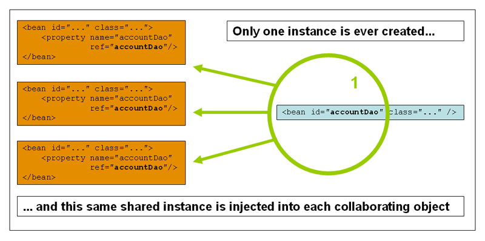
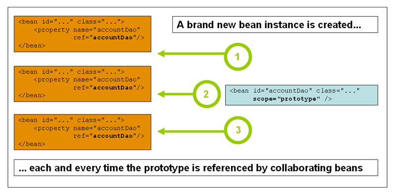

# 만들면서 배우는 스프링

## DI 컨테이너

### 학습목표
- 스프링 DI의 이해도를 높인다.

### 준비 사항
- IntelliJ에 Kotest 플러그인 설치

## 학습 테스트
- 스프링 IoC 컨테이너에 대해 좀 더 자세히 알아봅시다.
- 실패하는 학습 테스트를 통과시키시면 됩니다.
- 학습 테스트는 ioc 패키지 또는 클래스 단위로 실행하세요.

1. [스프링 IoC 컨테이너와 Bean 소개](src/test/kotlin/ioc/Introduction.kt)
2. [컨테이너 개요](src/test/kotlin/ioc/Container.kt)
3. [Bean 개요](src/test/kotlin/ioc/Bean.kt)
4. [의존성(Dependencies)](src/test/kotlin/ioc/Dependencies.kt)
5. [Bean 스코프](src/test/kotlin/ioc/BeanScopes.kt)
6. [Bean의 라이프 사이클](src/test/kotlin/ioc/Lifecycle.kt)
7. [어노테이션 기반 컨테이너 구성](src/test/kotlin/ioc/AnnotationBasedConfiguration.kt)
8. [자바 기반 컨테이 구성](src/test/kotlin/ioc/JavaBasedConfiguration.kt)

### 싱글톤 스코프

### 프로토타입 스코프

